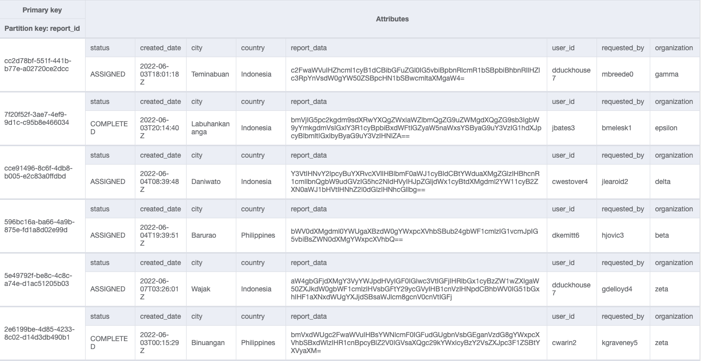
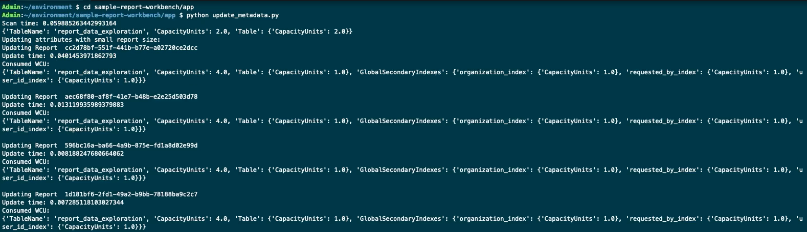
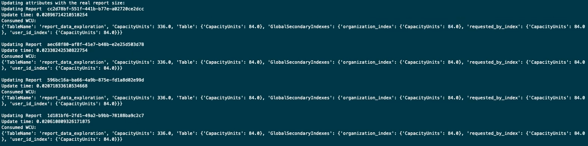
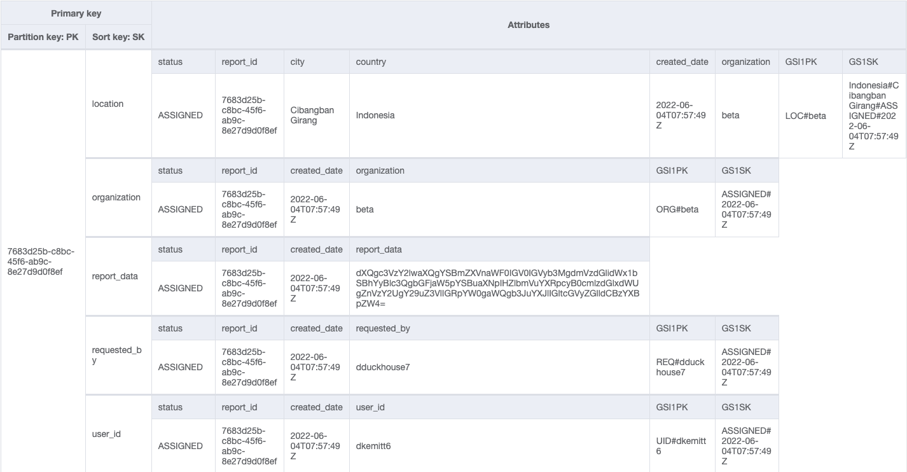
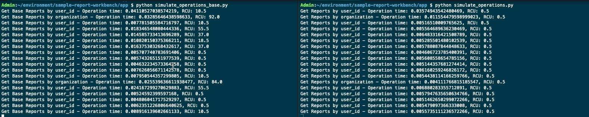
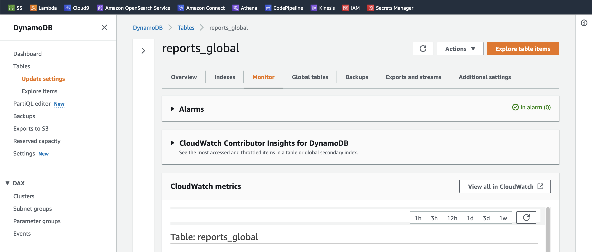
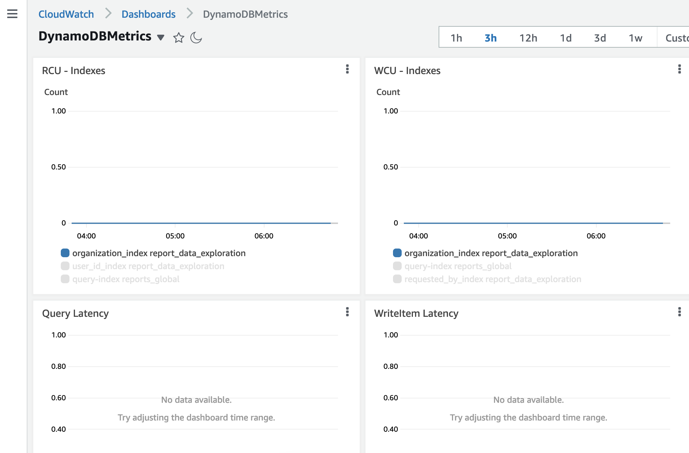

<!-- /*
 * Copyright Amazon.com, Inc. or its affiliates. All Rights Reserved.
 * SPDX-License-Identifier: MIT-0
 *
 * Permission is hereby granted, free of charge, to any person obtaining a copy of this
 * software and associated documentation files (the "Software"), to deal in the Software
 * without restriction, including without limitation the rights to use, copy, modify,
 * merge, publish, distribute, sublicense, and/or sell copies of the Software, and to
 * permit persons to whom the Software is furnished to do so.
 *
 * THE SOFTWARE IS PROVIDED "AS IS", WITHOUT WARRANTY OF ANY KIND, EXPRESS OR IMPLIED,
 * INCLUDING BUT NOT LIMITED TO THE WARRANTIES OF MERCHANTABILITY, FITNESS FOR A
 * PARTICULAR PURPOSE AND NONINFRINGEMENT. IN NO EVENT SHALL THE AUTHORS OR COPYRIGHT
 * HOLDERS BE LIABLE FOR ANY CLAIM, DAMAGES OR OTHER LIABILITY, WHETHER IN AN ACTION
 * OF CONTRACT, TORT OR OTHERWISE, ARISING FROM, OUT OF OR IN CONNECTION WITH THE
 * SOFTWARE OR THE USE OR OTHER DEALINGS IN THE SOFTWARE.
 */ -->

# Scenario

SomeCompany, Inc. is well known for managing and administering tasks from third parties’ systems, their initial application version was working on a server that was running on a colocation server facility and with the recent success of the application the engineering team needs to start thinking in terms of scaling. 

Recently, users have been complaining about application speed. What it used to take less than a second for a response in queries it is now being noticeable for the user, creating slow report query, or spinning wheel of despair!

Management was planning to move their application to the cloud and they have chosen AWS because of their experience and depth on services. They are working on serverless first approach where they can scale up and down as required by the application but also to have global replication, since the users might connect now from different parts of the world, and they want to write locally to avoid big latencies on their report’s retrieval use case. 

## Application Access Patterns 

Currently all the report information is stored in the database (Including the report itself).

- Reports are created by users as required. When a report is created the `status` is set to *CREATED*.
- Every 4 hours an application will retrieve all the new reports and assign them to a user. When this happens, the reports will have the `status` *ASSIGNED*.
- When a user logs in in the application/system they will have a dashboard with ~10 reports to complete/work during the day.
- Users will only retrieve reports that are in "ASSIGNED" status, but they have the option of search for old reports based on status and date. 
- People from different geographies will retrieve the reports, they could find the report by either, `report_id`, `city`, `country`, `owner`, `user_id`, `requested_by`, `organization` and date. 
- When a user completes a report, it will update its `status` to *COMPLETED*.
- When a user starts working on a report it will update its `status` to *INPROGRESS*.
  

## Converting it into simply words
Every single data model exercise starts with a translation of the application access patterns to very simple entities and in very simple words. In this scenario:

- Create report.
- Update report by `report_id`
- Get reports by `user_id` and `status` is *ASSIGNED* sorted by date ASC
- Get reports by `report_id`
- Get reports by location sorted by date.
- Get reports by `requested_by` sorted by `status` and date.
- Get reports by `organization` sorted by `status` and date.

## Identify the Partition key

By listing the access patterns into simple words, you achieve two benefits: the first one, it will clear all the extra information that is not useful while identify a Partition Key, and the second is that by the end of the list you should already have a good idea of what entity could be a good partition key.

For our case, almost all the statements contains *reports* as identifier, and the queries are based on a `report_id`, the other good news is that `report_id` is a high cardinal attribute per nature since most of the systems generate UUIDs.

If you are coming straight from a relational background, you will think the table structure it’s pretty simple, and you could create the basic structure like this:

It is very common to see developers and application architects to use high normalized data models in NoSQL, for very simple use cases it can work, but we always recommend to properly analyse your access patterns; let's see the impact of having a normalized use case.

## Working with NoSQL workbench

In this demo we will be showing how easy is to create a data model using NoSQL workbench, define your tables, Global Secondary Indexes, populate it with sample data, push your changes to your AWS account and explore queries and sample code the tool generates for you to bootstrap your projects.

You need to open the NoSQL application and click on create data model, on the top right side of the screen, to create a datamodel you need to provide a name, in this case it is `Reports Sample`, and you need to specify an owner, and optionally a description.

Once the data model is created you need to define a new table, as per our use-case introduction we will be naming our table `report_data_exploration` this table will have a single partition key which will be `report_id`. 

It is not required but it’s very helpful to create the other attributes in your table `report_id`, `status`, `created_date`, `city`, `country`, `report_data`, `user_id`, `requested_by`, and `organization`.
 
Since we are working with a key value database, we will always need to provide a Partition Key, our scenario will be `report_id`, but you might think, how can I query by `organization` or by `user_id`? This is where GSI come to our rescue, since you can specify different attributes from the attributes in the base table. 

We will create 3 GSIs so we can query based on `organization`, `user_id` and `requested_by`. 

- `user_id_index` index
- `organization_index` index
- `requested_by_index` index

Scrolling down the index creation you can see a checkbox, where you can modify the table settings as you might require, since we are still in data exploration mode, and we really don't know how the solution will behave I recommend to switch the tables to on-demand so we can work in a pay as you go pricing; If you prefer to use the free tier, set the table capacity to 5 RCU and 5 WCUs.

Once you hit save you will realize the table doesn't have any data, likely for us NoSQL workbench has a very useful tool that allow us import CSV files to our data model, so it’s easier to visualize. To import data, please select the import csv file from the top right section in the screen, Select the file that is provided with the sample application called [`report_data_exploration.csv`](./../workbench/report_data_exploration.csv), once the import process finish you will see the application loads the rows, please scroll all the way down and delete the last row, and save the contents. 

When you click in aggregate view is when the magic happens, you can see how NoSQL workbench really helps in visualizing the data. To retrieve a report from the base table you need to provide the `report_id`, but to retrieve all the reports for an organization you will need to use the organization_index GSI and provide the `organization` and a sort key condition based on `created_date`, with sort key conditions you can just request the data that is older than `2022-06-03T00:00:00`, and not having to retrieve all historical data for your query, or you can specify the **BEGINS_WITH** condition.

With NoSQL workbench we can also write this table into our AWS account, to explore how do it first, click on the operations tab the left section of the screen and select the connection you want to use, NoSQL workbench will read your credentials file, but you can also specify the secret and access key to connect to your AWS environment. notice that you can also use [DynamoDB local](https://docs.aws.amazon.com/amazondynamodb/latest/developerguide/DynamoDBLocal.html) for purely local debugging. 

Now it is time to go back to the Data visualization screen and click in commit changes, this process might take a minute or so, but it will create the Amazon DynamoDB table, and then populate with our sample data in the region that we have chosen. When you have the success indicator, let's use the operation builder to monitor our, data, you can see it is there, and you can for example query all the reports greater than `2022-06-03T00:00:00`, for the `organization=gamma`, using the `organization_index`.

Another great feature is to actually see some application code that is generated for the tool, so you can bootstrap your development, by clicking on the Generate application code.

## Switching to the AWS console.

For this section you can follow the demo in your own laptop or you can create an [AWS Cloud9](https://docs.aws.amazon.com/cloud9/latest/user-guide/create-environment-main.html) Environment, I will using Cloud9. You will need to clone this repository and navigate to the right directory `/app`.

### Scenarios

#### Scenario 1.

In this first scenario I want to highlight the importance of always design your data models thinking about cost! specially while you are working with many GSIs. If you project all the attributes to all the GSIs, your writes to the base table will need to be replicated to the GSIs, as many times as indexes you have! in our case it will be 3 times, which doesn't seem to be a big number, but let's see it in more detail. 

Open the Cloud9 environment, and run the script `update_metadata.py` this script will scan the table that we pushed using NoSQL workbench and then update the date when the report is accessed. Run the script and see how it behaves. 

You can see the execution times are pretty fast, and the WCU consumption is not very high either, in total you are consuming 4 WCUs.

#### Scenario 2.

If we put things in retrospective, the reports_data that we have in our "sample dataset" is not very realistic, it is only a couple of bytes and reports are in the order of 100's of Kbs, so let's update this table with the real report value (remember at the beginning we mention the company is storing everything in their database), by running the script `set_report_size.py` and, in a new terminal run the `update_metadata.py` script. 

The big difference is happening because of the data replication! even if we are not modifying the report_data content which is the big attribute, we are modifying an attribute in the GSI and that data would need to be replicated across.

#### Scenario 3. 

Let's finish uploading the data to the table by running the script `populate_base_table.py`, this script will populate the table with at least 1000 different reports following the format from the data exploration table. 

#### Scenario 4 - Back to NoSQL workbench

I have pre-created the scenario to speed up things, so please let's go to import, select the file [`reports_final.json`](./../workbench/reports_final.json) and once you complete the import you can click in the second table generated on the left side of the screen. 

This table have a generic Partition key PK and Sort key SK, this is the basics of data modelling where you can re-use your partition key to store many entities in the same table, NoSQL workbench call this a facet. The concept is very simple, under the same partition key (`report_id` in our case) you add different values to the SK (as many as you need). For example: One for the `report_data`, another for the `user_id`, `requested_by`, `organization`, `location`, etc, you can add as many values as required, you just need to ensure they are unique and they benefit your queries. 

To explore even further other options that NoSQL presents, let's create the new table with operations builder, select the connection and the right region, you should see at least your `report_data_exploration` table, and select under operations, **createTable**, give the table name `reports_global` , partition key as PK, and sort key as SK. Create a GSI `query-index` and Partition key GSI1PK and GSI1SK, notice that we only have one and the project type will be all. Uncheck the default settings and set the table and the GSI to on demand, don't forget to hit the button Run. And you should see a success checkbox at the bottom.

#### Scenario 5 - Compare normalized vs denormalized data models

Let's go back to Cloud9 and populate this new table with sample data by running the script `populate_final_table.py` this will insert the same information that we entered for the `report_data_exploration` table, only that we denormalized it. 

Create two tabs, one for the base table and another for the denormalized table and run the scrips `simulate operations` in both sides, one of the operations will be run in the base table and the other in the denormalized and compare results!

This script will run for 1 minute, running every second a query for a user, and every 10 seconds we run an organization query requesting all the reports for a given day. Compare the results, it is clear that the greatest impact is on RCUs!

As final observation this data model also storing the reports to S3 since its 10% of storage cost from DynamoDB and it will allow to get bigger reports with no change at all on the datamodel, or the DynamoDB metadata.

# Second Part. 

Well, now the table has been created and we have enough information to analyse it in Amazon CloudWatch so you can see a trend in the graphics. 

## Table metrics

One easy way to create Amazon CloudWatch dashboards for Amazon DynamoDB tables, is to open the "CloudWatch metrics" section under, "Monitoring" tab in the DynamoDB table settings. 

 

Follow this procedure:
1. Under the CloudWatch metrics section, in the one of your DynamoDB tables, click on the "View all in CloudWatch" to open a new tab. 
2. Under the metrics section, select "Table Metrics", scroll down until you find the name of the table you want to analyse, in our case it will be the indexes on the tables `reports_global` and `report_sample_exploration`. 
3. Select the metric `ConsumedReadCapacityUnits`, and both graphics will appear in the screen. 
4. Set a name for this metric for example `Consumed RCU`.
5. On the top right side of the screen, from the drop-down menu select, "Actions", Add to dashboard. 
6. You can add this graphic to an existing dashboard or to a new one, click on create new one and set the value as "Report-sample-dashboard". Set the widget type to line, and confirm the tittle is the one as the one you set on step 4. 
7. Click in the Add to dashboard button at the end. 
8. Create a new widget for the following statistics:
   - `Consumed WCU`, select `ConsumedWriteCapacityUnits` for the same two tables as step 2. 
   - `Query Latency`, select `SucessfulRequestLatency` for the same two tables as step 2. 
   - `Write Item Latency` select `SucessfulRequestLatency` for the same two tables as step 2. 
  

## Results

From side to side, you can see the consumption was incredibly higher in the table with normalized data, and it was much more efficient on the denormalized table, the latency was also impacted, the bigger the item the longer it takes to read it and write it.

In this demo we covered how to use NoSQL workbench, create your data models, populate data, and write the information to the AWS console, we even discovered the NoSQL workbench tool generates code for us to bootstrap our development. It also allows to modify tables and indexes and run data operations. We showed as well how important is to always think about cost during your table design and how a simple denormalization technique helped us to save a lot of read and write cost while working with DynamoDB tables. 

Remember DynamoDB will provide great throughput and great latency for different queries, however you need to build a data model that allows it, but denormalizing your data and using the right tool for the right job, as in the case to sending the reports to S3 and keeping the meta-data only in DDB. 

